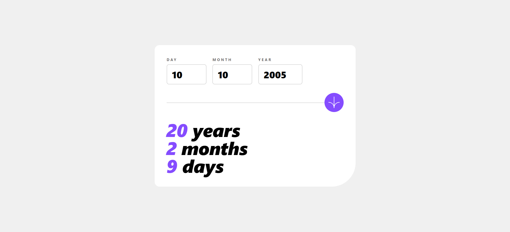

# Age Calculator App



## Overview

A responsive web application that calculates a person's age in years, months, and days based on their birth date. The app features real-time form validation, error handling, and smooth animations. This project was built as a Frontend Mentor challenge to practice HTML, CSS, and JavaScript skills.

## Features

- **Age Calculation**: Displays age in years, months, and days after submitting a valid date
- **Form Validation**: Comprehensive validation with helpful error messages for:
  - Empty fields
  - Invalid day (not between 1-31)
  - Invalid month (not between 1-12)
  - Future dates
  - Invalid dates (e.g., 31st of April)
- **Responsive Design**: Optimized layouts for mobile (375px) and desktop (1440px) devices
- **Interactive Elements**: Hover and focus states for all input fields and buttons
- **Animated Numbers**: Smooth counting animation when the form is submitted
- **Modern UI**: Built with Tailwind CSS for a clean, professional appearance

## Tech Stack

- **HTML5**: Semantic markup and form structure
- **CSS3 / Tailwind CSS**: Responsive styling and utility-first CSS framework
- **JavaScript**: Form validation, age calculation logic, and animation effects
- **Moment.js**: Date parsing and manipulation
- **Tailwind CSS CLI**: For building and watching CSS changes

## Getting Started

### Prerequisites

- Node.js (v14 or higher)
- npm or yarn package manager

### Installation

1. **Clone the repository**
   ```bash
   git clone https://github.com/alaa-mekibes/age-calculator
   cd age-calculator
   ```

2. **Install dependencies**
   ```bash
   npm install
   ```

3. **Start the development server**
   ```bash
   npm run dev
   ```
   This command watches for changes in `src/input.css` and rebuilds the CSS output to `dist/style.css`.

4. **Open the application**
   - Open `dist/index.html` in your web browser
   - Or use a local server to serve the files

## Project Structure

```
age-calculator
├── dist/
│   ├── index.html          # Main HTML file
│   ├── style.css           # Compiled Tailwind CSS
│   ├── main.js             # JavaScript logic
│   └── assets/             # Images and icons
├── src/
│   └── input.css           # Tailwind CSS source file
├── package.json            # Project dependencies
└── README.md              # This file
```

## Usage

1. Enter your birth date by filling in the Day, Month, and Year fields
2. Click the submit button (calendar icon)
3. The app will calculate and display your age in years, months, and days
4. Numbers animate smoothly to the final values
5. If there are validation errors, helpful messages will appear below the relevant fields

## Design Tokens

### Colors
- **Primary**: Purple (`hsl(259, 100%, 65%)`)
- **Error**: Red (`hsl(0, 100%, 67%)`)
- **Background**: White (`hsl(0, 100%, 100%)`)
- **Text**: Black (`hsl(0, 0%, 0%)`)


## Development

### Available Scripts

- `npm run dev` - Watches and builds CSS with Tailwind CLI

### Customization

To modify the styling:
1. Edit `src/input.css` with your Tailwind CSS changes
2. The `npm run dev` command automatically rebuilds the CSS
3. Refresh your browser to see the changes

## Validation Rules

The app validates the following:
- ✓ All fields must be filled
- ✓ Day must be between 1-31
- ✓ Month must be between 1-12
- ✓ Date cannot be in the future
- ✓ Date must be valid (e.g., no 31st of February)

## Browser Compatibility

- Chrome (latest)
- Firefox (latest)
- Safari (latest)
- Edge (latest)

## Accessibility

- Semantic HTML structure
- Proper form labels and input associations
- Keyboard navigable
- Clear error messages for validation failures
- WCAG compliant color contrast ratios

## License

ISC
